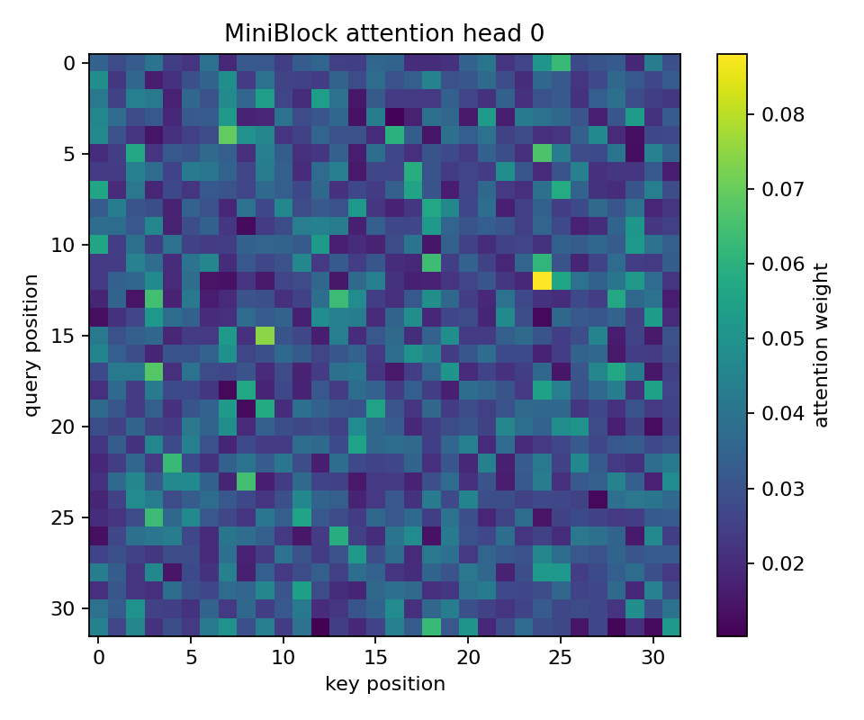

# Week-1 - Day-3: Introspection & Docs

## Summary

Day-1 built a minimal Transformer block in `mini_block.py` and verified it with `mini_block_test.py`.

Day-2 explored the nanoGPT stack in `nanoGPT/`: `model.py` for the GPT model, `train.py` for the training loop, `sample.py` for generation, and `tokenizer_demo.py` for tokenization.

## Param / FLOP Summary

The rough FLOP estimate here follows the requested rule of thumb: `2 x params` for one forward pass.

- Tiny GPT (`n_layer=2, n_head=2, n_embd=128, block_size=32, vocab_size=50304`)
  - Params: 6,839,808
  - FLOPs: 13,679,616
- MiniBlock (`n_embd=128, n_head=2`)
  - Params: 197,760
  - FLOPs: 395,520

## What q/k/v Shapes Mean

For an input `x` with shape `(B, T, C)`:

- `B` is batch size.
- `T` is sequence length.
- `C` is embedding size.

`MiniBlock` projects `x` into `qkv` and reshapes it to `(B, T, 3, n_head, head_dim)`.

After splitting:

- `q`, `k`, and `v` each have shape `(B, T, n_head, head_dim)`.
- For attention math, the head dimension is moved in front of time, giving `(B, n_head, T, head_dim)`.
- Attention weights become `(B, n_head, T, T)` after `q @ k.transpose(-2, -1)`.
- Those weights are softmaxed over keys, multiplied by `v`, and then reassembled to `(B, T, C)`.

## Attention Visualization

`MiniBlock` can now return attention weights. The first head heat-map is saved to `assets/attn_head0.png` and embedded below.



## Quick Start

Run the inspection script:

```bash
python inspect_model.py
```

Run the `MiniBlock` smoke test:

```bash
python mini_block_test.py
```

Generate the attention heat-map:

```bash
python visualize_attention.py
```

Try the tokenizer demo:

```bash
python tokenizer_demo.py
```

Run a tiny nanoGPT training example from the repo:

```bash
python nanoGPT/train.py --device=cpu --compile=False --block_size=32 --batch_size=8 --n_layer=2 --n_head=2 --n_embd=128 --max_iters=100
```

Sample from a checkpoint:

```bash
python nanoGPT/sample.py --out_dir=out --device=cpu
```